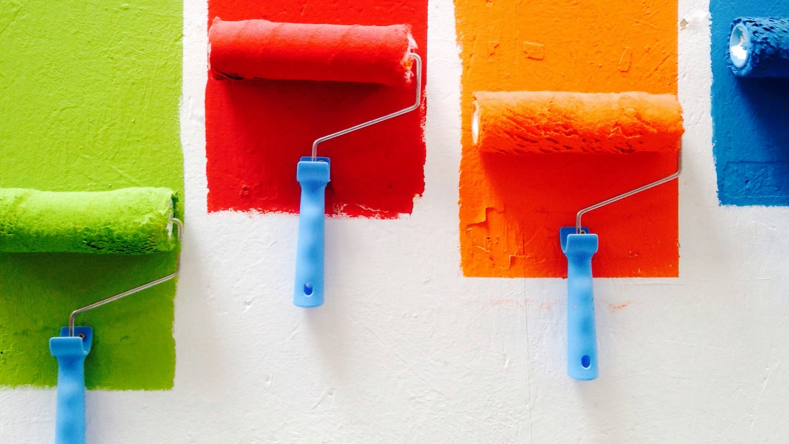
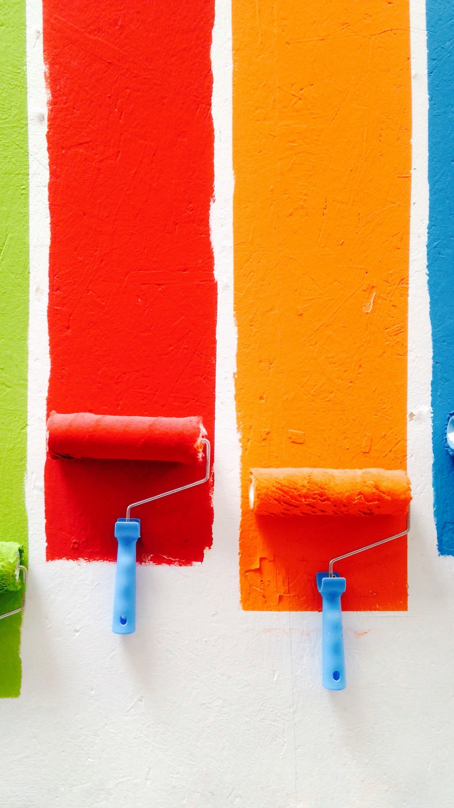
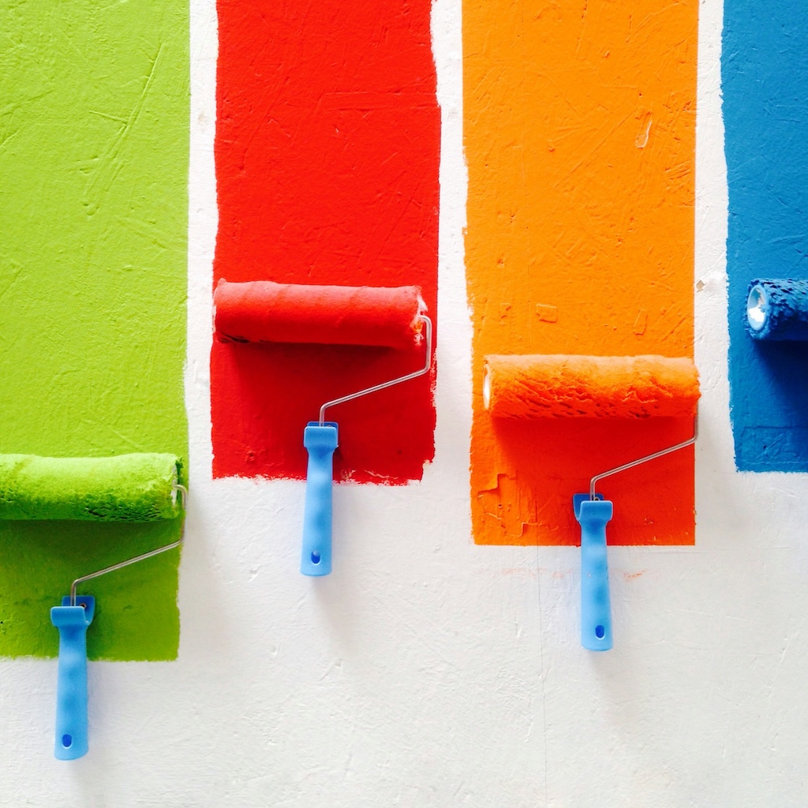

<div align="center">
  
  <h1>Sean's Wallpaper Archive</h1>
  <p>A collection of desktop, multi-desktop, and mobile wallpapers gathered from all over the internet</p>
  <p>
    <a href="wallpapers/">Browse the archive</a>
    · <a href="docs/CONTRIBUTING.md">Contribute</a>
    · <a href="CHANGELOG.md">Changelog</a>
  </p>
</div>

## About

Sean's Wallpaper Archive brings together wallpapers for single desktops,
multiple monitors, ultrawide displays, mobile devices, and square layouts.
The collection includes photography, illustrations, abstract designs, retro
graphics, games, science fiction, and coordinated themes.

Images are organized first by display format, then by a flat category. Browse
by the subject or style you want, download an image, and use your device's
wallpaper settings to apply it. There is no application to install or build.

The initial collection contains **1,252 images** across six display formats.

## Browse by display format

| Format | Intended layout | Images in the initial collection |
| --- | --- | ---: |
| [Desktops](wallpapers/desktops/) | Single desktop displays | 965 |
| [Ultrawide](wallpapers/ultrawide/) | Wide single-display layouts | 65 |
| [Dual](wallpapers/dual/) | Two-monitor panoramas and matching panel pairs | 109 |
| [Triple](wallpapers/triple/) | Three-monitor panoramas | 47 |
| [Mobile](wallpapers/mobile/) | Portrait displays and phones | 58 |
| [Square](wallpapers/square/) | Square images and flexible crops | 8 |

Formats describe the intended layout; individual resolutions and aspect ratios
vary. For panel pairs, filenames ending in `-left-panel` and `-right-panel`
identify the image for each monitor.

Categories include `abstract`, `art`, `cars`, `fantasy`, `gaming`, `history`,
`inspiration`, `minimal`, `music`, `original`, `outdoors`, `pop-culture`,
`retro`, `science`, `scifi`, `space`, `star-trek`, `star-wars`, `tech`,
`themes`, and `urban`. Category contents vary by display format.

See the [organization guide](docs/ORGANIZATION.md) for category definitions,
illustration placement, retro styles, and filename conventions.

<details>
<summary>Portrait and square previews</summary>

<p align="center">
  
  
</p>

</details>

## Download and use

Browse [wallpapers/](wallpapers/) and download individual images from their file
pages. Wallpaper images are stored with [Git LFS](https://git-lfs.com/).
Install Git LFS before cloning a local copy of the entire collection:

```sh
git lfs install
git clone https://github.com/seangalie/wallpapers.git
cd wallpapers
git lfs pull
```

`git lfs pull` downloads the actual images if your checkout contains small LFS
pointer files. See [GitHub's Git LFS setup guide](https://docs.github.com/en/repositories/working-with-files/managing-large-files/configuring-git-large-file-storage)
for more details.

Downloadable wallpaper ZIP files are still being planned for the first 1.0.0
release. GitHub's automatic **Download ZIP** archives contain LFS pointers by
default unless the repository setting to include LFS objects is enabled; see
[GitHub's archive documentation](https://docs.github.com/en/repositories/managing-your-repositorys-settings-and-features/managing-repository-settings/managing-git-lfs-objects-in-archives-of-your-repository).

Choose an image that suits your screen dimensions, then select it in your
desktop or mobile wallpaper settings. A spanning panorama works best when its
aspect ratio matches the combined monitor layout; panel pairs can be applied
to each display separately.

## Contribute and get help

New wallpapers, filename and category corrections, source credits, and
documentation improvements are welcome. Start with the
[contributing guide](docs/CONTRIBUTING.md).

For questions and suggestions, see the [support guide](docs/SUPPORT.md) or
[open an issue](https://github.com/seangalie/wallpapers/issues).
Report security concerns using the [security policy](docs/SECURITY.md).
Community participation follows the [code of conduct](docs/CODE_OF_CONDUCT.md).

## Changelog

Collection additions, organization changes, and corrections are recorded in
[CHANGELOG.md](CHANGELOG.md). Work awaiting a release is listed under
**Unreleased**, which is the working record for the planned 1.0.0 release.

## Credits and license

The archive is maintained by [Sean Galie](https://github.com/seangalie).
Thanks to the artists, photographers, and communities whose work appears in
the collection. If you can identify a missing or incorrect credit, please
include the image's path and original source in an issue or pull request.

Wallpaper and preview image copyrights remain with their original creators
and rights holders. Most image license terms are unknown; inclusion here does
not grant permission to reuse an image. The Apache license does not cover them.

Repository-authored documentation, configuration, and code use the
[Apache License 2.0](LICENSE-APACHE), with existing third-party notices retained.
See [LICENSE](LICENSE) for the full licensing scope and how to submit credits
or rights-holder requests.
