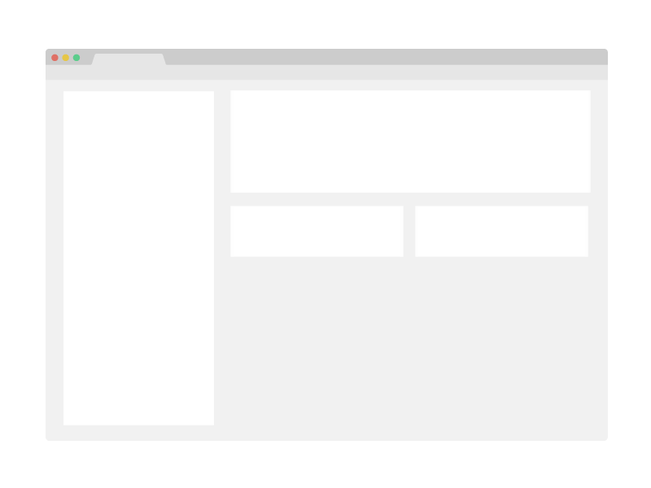

# wallpapers
A short description of wallpapers goes here.

  <a href="https://github.com/seangalie/wallpapers/issues/new?assignees=&labels=bug&template=01_bug_report.yml&title=bug%3A+">Report a Bug</a>
  ·
  <a href="https://github.com/seangalie/wallpapers/issues/new?assignees=&labels=enhancement&template=02_feature_request.yml&title=feat%3A+">Request a Feature</a>
  ·
  <a href="https://github.com/seangalie/wallpapers/discussions">Ask a Question</a>

  

  

Table of Contents

- [About](#about)
  - [Built With](#built-with)
- [Getting Started](#getting-started)
  - [Prerequisites](#prerequisites)
  - [Installation](#installation)
- [Usage](#usage)
- [Roadmap](#roadmap)
- [Changelog](#changelog)
- [Support](#support)
- [Project assistance](#project-assistance)
- [Contributing](#contributing)
- [Authors & contributors](#authors--contributors)
- [Security](#security)
- [License](#license)
- [Acknowledgements](#acknowledgements)

## About

> **[?]**
> Provide general information about your project here.
> What problem does it (intend to) solve?
> What is the purpose of your project?
> Why did you undertake it?
> You don't have to answer all the questions -- just the ones relevant to your project.

Screenshots

 

> **[?]**
> Please provide your screenshots here.

|                               Home Page                               |                               Login Page                               |
| :-------------------------------------------------------------------: | :--------------------------------------------------------------------: |
|  |  |

### Built With

> **[?]**
> Please provide the technologies that are used in the project.

## Getting Started

### Prerequisites

> **[?]**
> What are the project requirements/dependencies?

### Installation

> **[?]**
> Describe how to install and get started with the project.

## Usage

> **[?]**
> How does one go about using it?
> Provide various use cases and code examples here.

## Roadmap

See the [open issues](https://github.com/seangalie/wallpapers/issues) for a list of proposed features (and known issues).

- [Top Feature Requests](https://github.com/seangalie/wallpapers/issues?q=label%3Aenhancement+is%3Aopen+sort%3Areactions-%2B1-desc) (Add your votes using the 👍 reaction)
- [Top Bugs](https://github.com/seangalie/wallpapers/issues?q=is%3Aissue+is%3Aopen+label%3Abug+sort%3Areactions-%2B1-desc) (Add your votes using the 👍 reaction)
- [Newest Bugs](https://github.com/seangalie/wallpapers/issues?q=is%3Aopen+is%3Aissue+label%3Abug)

## Changelog

Notable changes to each release are recorded in [CHANGELOG.md](CHANGELOG.md).

## Support

See [our support guide](docs/SUPPORT.md) for where to ask what, and what to expect.

> **[?]**
> Add any other ways to reach the maintainers here -- a chat channel, a mailing
> list, an email address.

The quickest routes are this repository's [discussions](https://github.com/seangalie/wallpapers/discussions) and the maintainer's [GitHub profile](https://github.com/seangalie).

## Project assistance

If you want to say **thank you** and/or support active development of wallpapers:

- Add a [GitHub Star](https://github.com/seangalie/wallpapers) to the project.
- Post about wallpapers on X/Twitter, BlueSky, Mastodon, or your favorite social channels.
- Share more about wallpapers with your favorite communities or on your personal blog.

Together, we can make wallpapers **better**!

## Contributing

First off, thanks for taking the time to contribute! Contributions are what make the open-source community such an amazing place to learn, inspire, and create. Any contributions you make will benefit everybody else and are **greatly appreciated**.

Please read [our contribution guidelines](docs/CONTRIBUTING.md), and thank you for being involved!

## Authors & contributors

The original setup of this repository is by [Sean Galie](https://github.com/seangalie).

For a full list of all authors and contributors, see [the contributors page](https://github.com/seangalie/wallpapers/contributors).

## Security

wallpapers follows good practices of security, but 100% security cannot be assured.
wallpapers is provided **"as is"** without any **warranty**. Use at your own risk.

_For more information and to report security issues, please refer to our [security documentation](docs/SECURITY.md)._

## License

This project is licensed under the **Apache 2.0 license**.

See [LICENSE](LICENSE) for more information.

## Acknowledgements

> **[?]**
> If your work was funded by any organization or institution, acknowledge their support here.
> In addition, if your work relies on other software libraries, or was inspired by looking at other work, it is appropriate to acknowledge this intellectual debt too.
